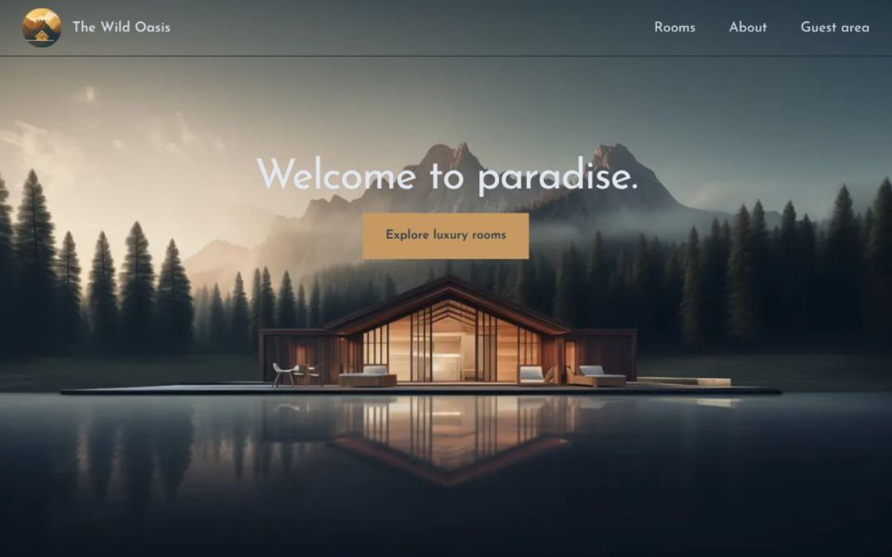

# 🌿 The Wild Oasis

A modern hotel/room management web application built with **Next.js** and **React.js**, designed for managing bookings, guests, rooms, and reservations in a clean and user-friendly way.

---

## 🚀 Live Demo

https://the-wild-oasis-ten-kappa.vercel.app/

---

## 📸 Preview

---

## 🧠 About the Project

The Wild Oasis is a full-stack web application users can:

- Browse available rooms
- Make reservations
- View booking history
- Manage their profile

Admins can:

- Manage cabins
- Track reservations
- Control availability
- Handle bookings

---

## 🛠️ Tech Stack

- Next.js (App Router)
- React
- JavaScript
- Tailwind CSS
- Server Actions
- REST API

---

